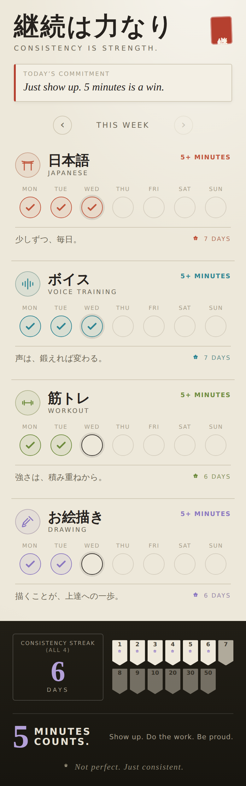

# 継続は力なり — Keizoku

*Consistency is strength.* A quiet, sumi-e (ink-wash) styled **daily habit
tracker**, built as an installable mobile web app (PWA).

Track a handful of small daily disciplines — the philosophy is *even 5 minutes
counts*. Tap a day to fill its ink ring, watch per-habit streaks grow, and keep
the "all four" consistency streak alive as milestone banners bloom.

<p align="center">
  
</p>

## Features

- **Four disciplines** — Japanese, Voice Training, Workout, Drawing — each with
  its own ink color and brush-mantra. (Edit them in `src/data/habits.js`.)
- **Weekly ink-ring grid** (Mon–Sun) you tap to mark done; swipe weeks with the
  arrows to review history.
- **Streaks** — a live per-habit streak plus the "All 4" consistency streak,
  both forgiving of the in-progress day (you only lose a streak when a full day
  passes incomplete).
- **Milestone banners** (1–50 days) that bloom a sakura as you pass them.
- **Editable daily commitment** note.
- **Offline-first PWA** — installs to your home screen, works with no network,
  and stores everything locally in your browser (`localStorage`). No account,
  no server, no tracking.

## Run it

```bash
npm install
npm run dev        # local dev server
npm run build      # production build into dist/
npm run preview    # serve the production build
```

Then open it on your phone and **Add to Home Screen** to install it as an app.

## Deploy (GitHub Pages)

The build is fully static. Build with the repo path as the base and publish
`dist/`:

```bash
BASE_PATH=/Chatter/ npm run build
```

## Tech

React + Vite, `vite-plugin-pwa` for the service worker & manifest. No backend.
Icons are generated from an inline SVG via `scripts/gen-icons.mjs`.

---

*Not perfect. Just consistent.*
